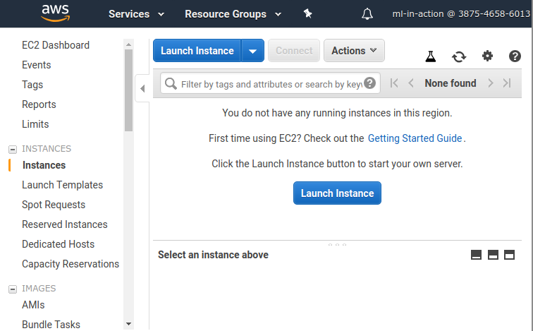
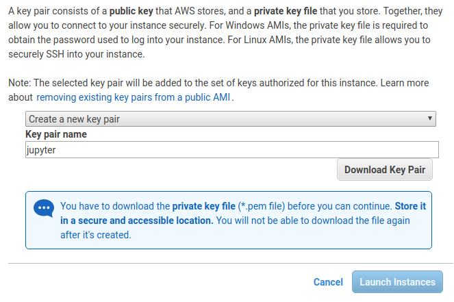

---

title: Renting a server on AWS
description: Creating an EC2 instance on AWS
image: article/img/cover/aws-ec2.jpg
layout: article

---

This article covers:

*   Creating an EC2 instance
*   Connecting to the instance
*   Shutting it down

We’ll show how to do it on AWS and create an EC2 (Elastic Compute Cloud) machine on AWS. EC2 is part of AWS and allows you to rent a server of any configuration for any duration of time.

To use AWS, you need to have an AWS account. If you don't have an account yet, see [Creating an AWS account](/article/aws).


## Creating an EC2 instance

EC2 is a service for renting a machine from AWS. You can use it to create a Linux machine to run Jupyter notebook and experiment with machine learning.

To do this, first go to the EC2 page in AWS. The easiest way to do this is by typing “EC2” in the “Find Services” box on the home page of the AWS Management Console; select “EC2” from the drop-down list and press “Enter”:


> **Note**:
> The screenshots were taken in October 2019. It’s possible that the content on the AWS web site and the appearance of the management console changed since then.

On the EC2 page, choose “Instances” from the menu on the left and then click “Launch Instance”:





This brings you to a six-step form.

The first step is to specify the AMI (Amazon Machine Image) you’ll use for the instance. We recommend Ubuntu: it’s one of the most popular Linux distributions and we used it for all the examples in this book. Other images should also work fine, but we haven’t tested them.

At the time of writing, Ubuntu Server 18.04 LTS is available, so use that one: find it in the list and then click “Select”.


Also note that this AMI is “Free tier eligible,” which means that if you use the free tier for testing AWS, you won’t be charged for using this AMI. 

After that you need to select the instance type. There are many options, with different numbers of CPU cores and different amounts of RAM. If you want to stay within the free tier, select “t2.micro” (figure A.25). It’s a rather small machine: it has only 1 CPU and 1 GB RAM. Of course, it’s not the best instance in terms of computing power, but it should be enough for experiments:


The next step is where you configure the instance details. You don’t need to change anything here and can simply go on to the next step, adding storage. Here, you specify how much space you need on the instance. The default suggestion is 8 GB, which is good enough for most of the projects we’ll do, so you can simply click “Next: Add Tags”. 


In the next step, you add tags to your new instance. The only tag you should add is “Name”, which allows you to give an instance a human-readable name. Add the key “Name” and the value “ml-bookcamp-instance” (or any other name you prefer):


The next step is quite an important one: here you choose the security group. This allows you to configure the network firewall and specify how the instance can be accessed and which ports are open.

To host Jupyter Notebook on the instance, you need to make sure the port 8888 is open and it’s possible to reach it from your laptop. 

Because you don’t yet have any security groups in your AWS account, you’ll need to create a new one now: choose “Create a New Security Group” and give it the name “jupyter”. You’ll want to use SSH to connect to the instance from your computers, so you need to make sure SSH connections are allowed. To enable this, select SSH in the “Type” drop-down list in the first row:


Typically the Jupyter Notebook service runs on port 8888, so you need to add a custom TCP rule saying that port 8888 can be accessed from anywhere on the internet.

When you do this, you may see a warning telling you that this might not be safe:


It’s not a problem for us: we are not running anything critical on the instances. Implementing proper security is out of scope for this article. 

The next time you create an instance, you’ll be able to reuse this security group instead of creating a new one: choose “Select an Existing Security Group” and select it from the list:


Configuring the security group is the last step. Verify that everything is fine, and click “Review and Launch”.  

AWS won’t let you launch the instance yet: you still need to configure the SSH keys for logging into the instance. Because your AWS account is still fresh and doesn’t have keys yet, you need to create a new key pair. Choose “Create a New Key Pair” from the drop-down list and give it the name “jupyter”:




Click “Download Key Pair” and save the file somewhere on your computer. Make sure you can access this file later: it’s important for being able to connect to the instance.

The next time you create an instance, you can reuse this key. Select “Choose an Existing Key Pair” in the first drop-down list, choose the key you want to use and click the checkbox to confirm that you still have the key:


Now you can launch the instance by clicking “Launch Instances”. You should see a confirmation that everything is good and the instance is launching:


In this message, you can see the ID of the instance. In our case, it’s “i-0b1a64d4d20997aff”. You can click on it now to see the details of the instance:


Because you want to use SSH to connect to your instance, you need to get the public DNS name to do it. You can find this on the “Description” tab.


## Connecting to the instance

In the previous section you created an instance on EC2. To log in to the instance and install the software there, you'll use SSH. 

The steps in this article work for Linux and macOS. For Windows, use the Windows subsystem for Linux. 

You already know the public DNS name of your instance. In our example, it’s “ec2-18-191-156-172.us-east-2.compute.amazonaws.com”. In your case the name will be different: the first part of the name (“ec2-18-191-156-172”) depends on the IP that the instance gets and the second (“us-east-2”) on the region where it’s running.

To use SSH to enter the instance, you will need this name. 

When using the key you downloaded from AWS for the first time, you need to make sure the permissions on the file are set correctly. Execute this command:


```
chmod 400 jupyter.pem
```

Now you can use the key to log in to the instance:

```
ssh -i "jupyter.pem" \
    ubuntu@ec2-18-191-156-172.us-east-2.compute.amazonaws.com
```


Of course, you should replace the DNS name shown here with the one you copied from the instance description.

Before allowing you to enter the machine, the SSH client will ask you to confirm that you trust the remote instance:


```
The authenticity of host 'ec2-18-191-156-172.us-east-2.compute.amazonaws.com (18.191.156.172)' can't be established.
ECDSA key fingerprint is SHA256:S5doTJOGwXVF3i1IFjB10RuHufaVSe+EDqKbGpIN0wI.
Are you sure you want to continue connecting (yes/no)? 
```


Type “yes” to confirm.

Now you should be able to log in to the instance and see the welcome message:


Now it’s possible to do anything you want with the machine. 

For example, [install Anaconda](https://docs.anaconda.com/anaconda/install/linux/) and run Jupyter:

```
jupyter notebook --ip=0.0.0.0 --no-browser
```


## Shutting down the instance

After you’ve finished working with the instance, you should turn it off.

> **Important**:
> It’s important to turn off the instance after the work is finished. For each second you use the instance, you get billed, even if you no longer need the machine and it’s idle. That doesn’t apply in the first 12 months of using AWS if the requested instance is free-tier eligible, but nonetheless, it’s good to develop the habit of periodically checking your account status and disabling unneeded services.

You can do this from the terminal:

```
sudo shutdown now
```


It’s also possible to do it from the web interface: select the instance you want to turn off, go to “Actions”, and select “Instance State” > “Stop”:


Once the instance has been stopped, you can start it again by choosing “Start” from the same submenu. It’s also possible to completely remove the instance: for this you need to use the “Terminate” option. 

And that’s it! Now you can rent EC2 instances on AWS and use them for experiments.
