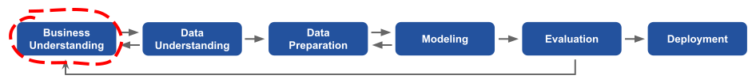
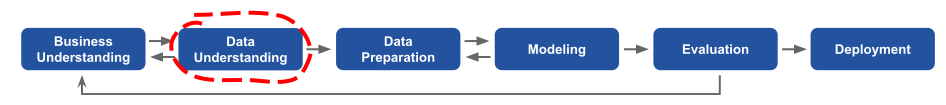
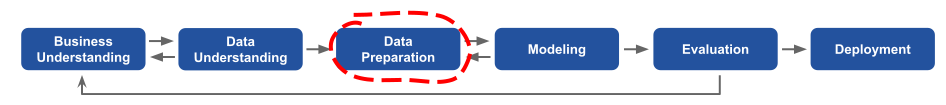
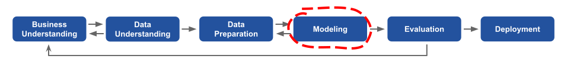
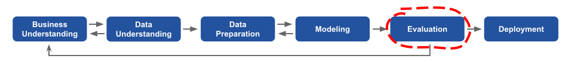
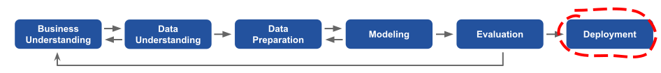

---

title: CRISP-DM
description: CRISP-DM 
image: article/img/cover/crisp-dm-new.jpg
layout: article

---

## CRISP-DM

Creating a machine learning system involves more than just selecting a model, training it, and applying it to new data. There are frameworks that help us organize machine learning projects.

One such framework is CRISP-DM — the Cross-Industry Standard Process for Data Mining. It was invented quite long ago, in 1996, but in spite of its age, it’s still applicable to today’s problems.

According to CRISP-DM, the machine learning process has six steps:

1. Business understanding
2. Data understanding
3. Data preparation
4. Modeling
5. Evaluation
6. Deployment

Each phase covers typical tasks:

*   In the business understanding step, we try to identify the problem, to understand how we can solve it, and to decide whether machine learning will be a useful tool for solving it.
*   In the data understanding step, we analyze available datasets and decide whether we need to collect more data.
*   In the data preparation step, we transform the data into tabular form that we can use as input for a machine learning model.
*   When the data is prepared, we move to the modeling step, in which we train a model.
*   After the best model is identified, there’s the evaluation step, where we evaluate the model to see if it solves the original business problem and measure its success at doing that.
*   Finally, in the deployment step, we deploy the model to the production environment.

&nbsp;

## Example

Suppose we want to build a spam detection system: for each email we get, we want to determine if it’s spam or not. If it is, we want to put it into the “spam” folder.

Let’s see how we can solve this problem with CRISP-DM.

&nbsp;

### Business understanding step

Our users started to complain about spam messages, so we decided to check if it’s something we can solve.

At the business understanding step, we analyze the problem and the existing solution and try to determine if adding machine learning to that system will help us stop spam messages.

In this step, we need to define the goal and how to measure it. The goal could be “Reduce the number of reported spam messages” or “Reduce the number of complaints about spam that customer support receives per day,” for example.

We may also decide that machine learning is not going to help and propose a simpler way to solve the problem.

&nbsp;

### Data understanding step

The next step is data understanding. Here, we try to identify the data sources we can use to solve the problem. If our site has a Report Spam button, for example, we can get the data generated by the users who marked their incoming emails as spam. Then we look at the data and analyze it to decide whether it’s good enough to solve our problem.

This data may be not good enough, however, for a wide range of reasons. One reason could be that the dataset is too small for us to learn any useful patterns. Another reason could be that the data is too noisy. The users may not use the button correctly, so it will be useless for training a machine learning model, or the data collection process could be broken, collecting only a small fraction of the data we want.

If we conclude that the data we currently have is not sufficient, we need to find a way to get better data, whether we acquire it from external sources or improve the way we collect it internally. It’s also possible that discoveries we make in this step will influence the goal we set in the business understanding step, so we may need to go back to that step and adjust the goal according to our findings.

When we have reliable data sources, we go to the data preparation step.

&nbsp;

### Data preparation step

In this step, we clean the data, transforming it in such a way that it can be used as input to a machine learning model. For the spam example, we transform the dataset into a set of features that we feed into a model later.

After the data is prepared, we go to the modeling step.

&nbsp;

### Modeling step

In this step, we decide which machine learning model to use and how to make sure that we get the best out of it. For example, we may decide to try logistic regression and a deep neural network to solve the spam problem.

We need to know how we will measure the performance of the models to select the best one. For the spam model, we can look at how well the model predicts spam messages and choose the one that does it best. For this purpose, setting a proper validation framework is important, which is why we will cover it in more detail in the next section.

It’s very likely that in this step, we need to go back and adjust the way we prepare the data. Perhaps we came up with a great feature, so we go back to the data preparation step to write some code to compute that feature. When the code is done, we train the model again to check whether this feature is good. We might add a feature “length of the subject”, retrain the model, and check whether this change improves the model's performance, for example.

After we select the best possible model, we go to the evaluation step.

&nbsp;

### Evaluation step

In this step, we check whether the model lives up to expectations. When we set the goal in the business understanding step, we also define the way of establishing whether the goal is achieved. Typically, we do this by looking at an important business metric and making sure that the model moves the metric in the right direction. In the spam-detection case, the metric could be the number of people who click the Report Spam button or the number of complaints about the issue we’re solving that customer support receives. In both cases, we hope that using the model reduces the number.

Nowadays, this step is tightly connected to the next step: deployment.

&nbsp;

### Deployment step

The best way to evaluate a model is to battle-test it: roll it out to a fraction of users and then check whether our business metric changes for these users. If we want our model to reduce the number of reported spam messages, for example, we expect to see fewer reports in this group compared with the rest of the users.

After the model is deployed, we use everything we learned in all the steps and go back to the first step to reflect on what we achieved (or didn’t achieve). We may realize that our initial goal was wrong and that what we actually want to do is not reduce the number of reports, but increase customer engagement by decreasing the amount of spam. So we go all the way back to the business understanding step to redefine our goal. Then, when we evaluate the model again, we use a different business metric to measure its success.

&nbsp;

### Iterate

As we can see, CRISP-DM emphasizes the iterative nature of machine learning processes: after the last step, we are always expected to go back to the first step, refine the original problem, and change it based on the learned information. We never stop at the last step; instead, we rethink the problem and see what we can do better in the next iteration.

It’s a very common misconception that machine learning engineers and data scientists spent their entire day training machine learning models. In reality, this idea is incorrect, as we can see in the CRISP-DM diagram. A lot of steps come before and after the modeling step, and all these steps are important for a successful machine learning project.
