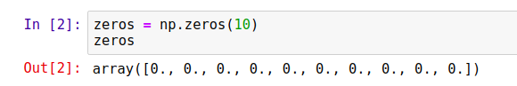
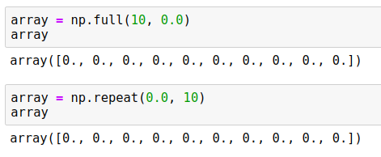
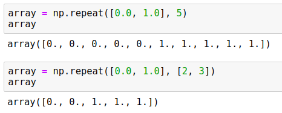
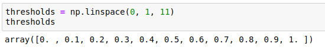
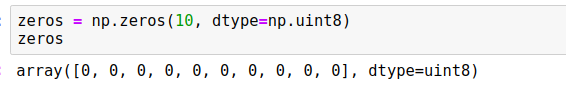
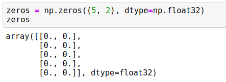
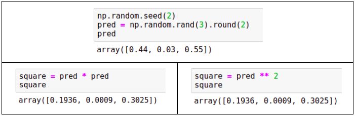
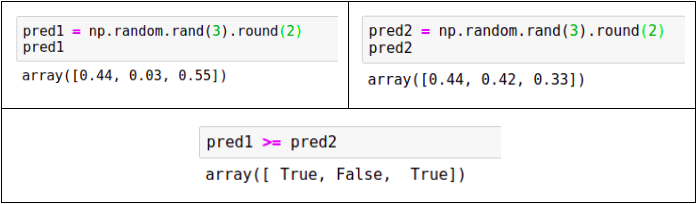
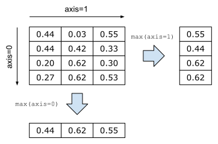
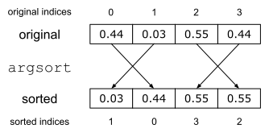

---

title: Introduction to NumPy
description: Get to know NumPy in 10 minutes!
image: article/img/cover/numpy.jpg
layout: article

---

# Introduction to NumPy


This article covers:

*   One-dimensional and two-dimensional NumPy arrays
*   Generating NumPy arrays randomly
*   Operations with NumPy arrays: element-wise operations, summarizing operations, sorting and filtering


To go through this tutorial, you need to have Python and Jupyter Notebook.
The easiest way to get them is to use [Anaconda](https://www.anaconda.com/).

For a Python refresher, check [Introduction to Python](/article/python).

&nbsp;

## NumPy

NumPy is a short name for “Numerical Python” &ndash; it’s a Python library for numerical manipulations. NumPy plays a central role in the python machine learning ecosystem: nearly all the libraries in Python depend on it. For example, Pandas, Scikit-Learn, and TensorFlow all rely on NumPy for numerical operations.

NumPy comes pre-installed in Anaconda distribution of NumPy, so if you use it, you don’t need to do anything extra. But if you don’t use Anaconda, installing NumPy is quite simple with pip:


```bash
pip install numpy
```

In order to use NumPy, we need to import it. That’s why in the first cell we write the import:


```python
import numpy as np
```


In the scientific Python community, it’s common to use an alias when importing NumPy, that’s why we add “`as np`” in the code. This allows us to write “`np`” in the code instead of “`numpy`”.

We’ll start exploring NumPy from its core data structure: NumPy array. 

&nbsp;

### NumPy arrays

NumPy arrays are similar to Python lists, but they are better optimized for number crunching tasks - like machine learning.

To create an array of a predefined size filled with zeros, we use the `np.zeros` function:


```python
zeros = np.zeros(10)
```


This creates an array with ten zero elements:



Likewise, we can create an array with ones using the `np.ones` function:


```
ones = np.ones(10)
```


It works exactly in the same way as zeros, except the elements are ones.

Both functions are a shortcut for a more general function `np.full`: it creates an array of a certain size filled with the specified element. For example, to create an array of size 10 filled with zeros, we do the following:


```python
array = np.full(10, 0.0) 
```


We can achieve the same result using the `np.repeat` function:


```python
array = np.repeat(0.0, 10) 
```


This code produces the same result as the code above:





While in this example both functions produce the same code, `np.repeat` is actually more powerful. For example, we can use it to create an array where multiple elements are repeated one after another:


```python
array = np.repeat([0.0, 1.0], 5)
```


It creates an array of size 10 where the number 0 is repeated 5 times, and then the number 1 is repeated 5 times:





We can even be more flexible and specify how many times each element should be repeated:


```python
array = np.repeat([0.0, 1.0], [2, 3])
```


In this case, 0.0 is repeated 2 times and 1.0 is repeated 3 times:


```
array([0., 0., 1., 1., 1.]) 
```


Like with lists, we can access an element of an array with square brackets:


```python
el = array[1]
print(el)
```


This code prints “0.0”.

Unlike usual Python lists, we can access multiple elements of the array at the same time by using a list with indices in the square brackets:


```python
print(array[[4, 2, 0]])
```


The result is another array of size 3 consisting of elements of the original array indexed by 4, 2 and 0 respectively:


```
[1., 1., 0.]
```


We can also update the elements of the array using square brackets:


```python
array[1] = 1
print(array)
```


Since we changed the element at index 1 from “0” to “1”, it prints the following:


```
[0. 1. 1. 1. 1.]
```


If we already have a list with numbers, we can convert it to a NumPy array using `np.array`:


```python
elements = [1, 2, 3, 4]
array = np.array(elements)
```


Now `array` is a NumPy array of size 4 with the same elements as the original list:


```
array([1, 2, 3, 4])
```


Another useful function for creating NumPy arrays is `np.arange`: it’s the NumPy equivalent of Python’s `range`:


```python
np.arange(10)
```


It creates an array of length 10 with numbers from 0 to 9, and like in standards Python’s `range`, 10 is not included in the array:


```
array([0, 1, 2, 3, 4, 5, 6, 7, 8, 9])
```


Often we need to create an array of a certain size filled with numbers between some number _x_ and some number _y_. For example, imagine that we need to create an array with number from 0 to 1:

<center>0.0, 0.1, 0.2, ..., 0.9, 1.0</center>

&nbsp;

We can use `np.linspace` for doing it:


```python
thresholds = np.linspace(0, 1, 11)
```


This function takes three parameters:


1. The starting number - in our case, we want to start from 0
2. The last number - we want to finish with 1
3. The length of the resulting array - in our case, we want 11 numbers in the array.

This code produces 11 numbers from 0 till 1:





Usual Python lists can contain elements of any type. This is not the case for NumPy arrays: all elements of an array must have the same type. These types are called _dtypes_.

There are four broad categories of dtypes:


*   Unsigned integers (`uint`) - integers that are always positive (or zero)
*   Signed integers (`int`) - integers that can be positive and negative
*   Floats (`float`) - real numbers
*   Booleans (`bool`) - only True and False values

There are multiple variations of each dtype depending on the number of bits used for representing the value in memory. 

For uint we have four types: `uint8`, `uint16`, `uint32`, `uint64` of size 8, 16, 32 and 64 bits respectively. Likewise, we have four types of int: `int8`, `int16`, `int32` and `int64`. The more bits we use, the larger numbers we can store:


<table class="table">
  <tr>
   <td>Size (bits)
   </td>
   <td><strong>uint</strong>
   </td>
   <td><strong>int</strong>
   </td>
   <td><strong>float</strong>
   </td>
  </tr>
  <tr>
   <td><strong>8</strong>
   </td>
   <td>0 .. 2<sup>8</sup> - 1
   </td>
   <td>-2<sup>7</sup> .. 2<sup>7</sup> - 1
   </td>
   <td>-
   </td>
  </tr>
  <tr>
   <td><strong>16</strong>
   </td>
   <td>0 .. 2<sup>16</sup> - 1
   </td>
   <td>-2<sup>15</sup> .. 2<sup>15</sup> - 1
   </td>
   <td>Half precision
   </td>
  </tr>
  <tr>
   <td><strong>32</strong>
   </td>
   <td>0 .. 2<sup>32</sup> - 1
   </td>
   <td>-2<sup>31</sup> .. 2<sup>31</sup> - 1
   </td>
   <td>Single precision
   </td>
  </tr>
  <tr>
   <td><strong>64</strong>
   </td>
   <td>0 .. 2<sup>64</sup> - 1
   </td>
   <td>-2<sup>63</sup> .. 2<sup>63</sup> - 1
   </td>
   <td>Double precision
   </td>
  </tr>
</table>


&nbsp;

In the case of floats, we have three types: `float16`, `float32,` and `float64`. The more bits we use, the more precise the float is. For most machine learning applications, `float32` is good enough: we typically don’t need great precision.
You can check the full list of different dtypes in the [official documentation](https://docs.scipy.org/doc/numpy-1.13.0/user/basics.types.html).

**Note**: In NumPy, the default float dtype is <code>float64</code>, which uses 64 bits (8 bytes) for each number. For most machine learning applications we don’t need such precision and we can reduce the memory footprint two times by using <code>float32</code> instead of <code>float64</code>.


When creating an array, we can specify the dtype. For example, when using `np.zeros` and `np.ones`, the default dtype is `float64`. We can specify the dtype when creating an array:


```python
zeros = np.zeros(10, dtype=np.uint8)
```



&nbsp;


When we have an array with integers and assign a number outside of the range, the number is cut: only the least significant bits are kept. 

For example, suppose we use the `uint8` array `zeros` we just created. Since the dtype is `uint8`, the largest number it can store is 255. Let’s try to assign 300 to the first element of the array:


```python
zeros[0] = 300
print(zeros[0])
```


Since 300 is greater than 255, only the least significant bits are kept, so this code prints “44”. 


**Warning**:
Be careful when choosing the dtype for an array. If you accidentally choose a dtype that’s too narrow, NumPy won’t warn you when you put in a big number. It will simply truncate them.


Iterating over all elements of an array is similar to list: we simply can use a `for` loop:


```python
for i in np.arange(5):
    print(i)
```


This code prints numbers from 0 till 4:


```
0
1
2
3
4
```

&nbsp;

### Two-dimensional NumPy arrays

So far we have covered one-dimensional NumPy arrays. We can think of these arrays as vectors. However, for machine learning applications, having only vectors is not enough: we also often need matrices.

In plain Python, we’d use a list of lists for that. In NumPy, the equivalent is a two-dimensional array. 

To create a two-dimensional arrays with zeros, we simply use a tuple instead of a number when invoking `np.zeros`:


```python
zeros = np.zeros((5, 2), dtype=np.float32)
```


We use a tuple “(5, 2)”, so it creates an array of zeros with 5 rows and 2 columns:




In the same way, we can use `np.ones` or `np.fill` - instead of a single number, we put in a tuple.

The dimensionality of an array is called _shape_. This is the first parameter we pass to the `np.zeros` function: it specifies how many rows and columns the array will have. To get the shape of an array, use the `shape` property:


```python
print(zeros.shape)
```


When we execute it, we see “(5, 2)”. 

It’s possible to convert a list of lists to a NumPy array. Like with usual lists of numbers, simply use `np.array` for that:


```python
numbers = [
    [1, 2, 3],
    [4, 5, 6],
    [7, 8, 9]
]

numbers = np.array(numbers)
```


After executing this code, `numbers` becomes a NumPy array with shape (3, 3). When we print it, we get:


```
array([[1, 2, 3],
       [4, 5, 6],
       [7, 8, 9]])
```


To access an element of a two-dimensional array, we need to use two numbers inside the brackets:


```python
print(numbers[0, 1])
```


This code will access the row indexed by 0 and column indexed by 1. So it will print “2”. 

Like with one-dimensional arrays, we use the assignment operator (“=”) to change an individual value of a two-dimensional array:


```python
numbers[0, 1] = 10
```


When we execute it, the content of the array changes:


```
array([[ 1, 10,  3],
       [ 4,  5,  6],
       [ 7,  8,  9]])
```


If instead of two numbers, we put only one, we get the entire row, which is a one-dimensional NumPy array:


```python
numbers[0]
```


This code returns the entire row indexed by 0:


```
array([1 2 3])
```


To access a column of a two-dimensional array, we use a colon (“:”) instead of the first element. Like with rows, the result is also a one-dimensional NumPy array: 


```python
numbers[:, 1]
```


When we execute it, we see the entire column:


```
array([2 5 8])
```


It’s also possible to overwrite the content of the entire row or a column using the assignment operator. For example, suppose we want to replace a row in the matrix:


```python
numbers[1] = [1, 1, 1]
```


This results in the following change:


```
array([[ 1, 10,  3],
       [ 1,  1,  1],
       [ 7,  8,  9]])
```


Likewise, we can replace the content of an entire column:


```python
numbers[:, 2] = [9, 9, 9]
```


As a result, the last column changes:


```
array([[ 1, 10,  9],
       [ 1,  1,  9],
       [ 7,  8,  9]])
```

&nbsp;

### Randomly generated arrays

Often it’s useful to generate arrays filled with random numbers. To do it in NumPy, we use the `np.random` module.

For example, to generate a 5x2 array of random numbers uniformly distributed between 0 and 1, use `np.random.rand`:


```python
arr = np.random.rand(5, 2)
```


When we run it, it generates an array that looks like that:


```
array([[0.64814431, 0.51283823],
       [0.40306102, 0.59236807],
       [0.94772704, 0.05777113],
       [0.32034757, 0.15150334],
       [0.10377917, 0.68786012]])
```


Every time we run the code, it generates a different result. Sometimes we need the results to be reproducible, which means that if we want to execute this code later, we will get the same results. To achieve that, we can set the seed of the random number generator. Once the seed is set, the random number generator produces the same sequence every time we run the code.


```python
np.random.seed(2)
arr = np.random.rand(5, 2)
```


On Ubuntu Linux 18.04 with NumPy version 1.17.2 it generates the following array:


```
array([[0.4359949 , 0.02592623],
       [0.54966248, 0.43532239],
       [0.4203678 , 0.33033482],
       [0.20464863, 0.61927097],
       [0.29965467, 0.26682728]])
```


No matter how many times we re-execute this cell, the results are the same. 


**Warning**:
Fixing the seed of the random number generator guarantees that the generator will produce the same results when executed on the same OS with the same NumPy version. However, there’s no guarantee that updating the NumPy version will not affect reproducibility: a change of version may result in changes in the random number generator algorithm, and that may lead to different results across versions. 


If instead of uniform distribution, we want to sample from the standard normal distribution, we use `np.random.randn`: 


```python
arr = np.random.randn(5, 2)
```

**Note**:
Every time we generate a random array in this appendix, we make sure we fix the seed number before generating it, even if we don’t explicitly specify it in the code - we do it for ensuring consistency. We use “2” as the seed. There’s no particular reason for this number.


To generate uniformly distributed random integers between 0 and 100 (exclusive), we can use `np.random.randint`:


```python
randint = np.random.randint(low=0, high=100, size=(5, 2))
```


When executing the code, we get a 5x2 NumPy array of integers:


```
array([[40, 15],
       [72, 22],
       [43, 82],
       [75,  7],
       [34, 49]])
```


Another quite useful feature is shuffling an array - rearranging the elements of an array in random order. For example, let’s create an array with a range and then shuffle it:


```python
idx = np.arange(5)
print('before shuffle', idx)

np.random.shuffle(idx)
print('after shuffle', idx)
```


When we run the code, we see the following:


```
before shuffle [0 1 2 3 4]
after shuffle  [2 3 0 4 1]
```

&nbsp;

## NumPy operations

NumPy comes with a wide range of operations that work with the NumPy arrays. In this section we’ll cover operations that we’ll need throughout the book.

&nbsp;

### Element-wise operations

NumPy arrays support all the arithmetic operations: addition (“+”), subtraction (“-”), multiplication (“*”), division (“/”) and others. 

To illustrate these operations, let’s first create an array using `arange`:


```python
rng = np.arange(5)
```


This array contains five elements from 0 till 4:


```
array([0, 1, 2, 3, 4])
```


To multiply every element of the array by two, we simply use the multiplication operator (“*”):


```python
rng * 2
```


As a result, we get a new array where each element from the original array is multiplied by two:


```
array([0, 2, 4, 6, 8])
```


Note that we don’t need to explicitly write any loops here to apply the multiplication operation individually to each element: NumPy does it for us. We can say that the multiplication operation is applied _element-wise_ - to all elements at once. The addition (“+”), subtraction (“-”) and division (“/”) operations are also element-wise and require no explicit loops.

Such element-wise operations are often called _vectorized_: the for loop happens internally in native code (written C and fortran), so the operations are very fast! 

**Note**:
Whenever possible, use vectorized operations from NumPy instead of loops: they are always a magnitude faster. 


In the previous code we used only one operation. It’s possible to apply multiple operations at once in one expression:


```python
(rng - 1) * 3 / 2 + 1
```


This code creates a new array with the result:


```
array([-0.5, 1. , 2.5, 4. , 5.5])
```


Note that the original array contains integers, but because we used the division operation, the result is an array with float numbers.

Previously, our code involved an array and simple Python numbers. It’s also possible to do element-wise operations with two arrays - if they have the same shape. 

For example, suppose we have two arrays, one containing numbers from 0 to 4, and another containing some random noise: 


```python
noise = 0.01 * np.random.rand(5)
numbers = np.arange(5)
```


We sometimes need to do that for modeling not-ideal real-life data: in reality there are always imperfections when the data is collected, and we can model these imperfections by adding noise.

We build the `noise` array by first generating numbers between 0 and 1 and then multiplying them by 0.01. This effectively generates random numbers between 0 and 0.01: 


```
array([0.00435995, 0.00025926, 0.00549662, 0.00435322, 0.00420368])
```


We can then add these two arrays and get a third one with the sum:


```python
result = numbers + noise
```


In this array, each element of the result is the sum of the respective elements of the two other arrays:


```
array([0.00435995, 1.00025926, 2.00549662, 3.00435322, 4.00420368])
```


We can round the numbers to any precision using the `round` method:


```python
result.round(4)
```


It’s also an element-wise operation, so it’s applied to all the elements at once and the numbers are rounded to the 4th digit:


```
array([0.0044, 1.0003, 2.0055, 3.0044, 4.0042])
```


Sometimes we need to square all the elements of an array. For that, we can simply multiply the array with itself. Let’s first generate an array:


```python
pred = np.random.rand(3).round(2)
```


This array contains 3 random numbers:


```
array([0.44, 0.03, 0.55])
```


Now we can multiply it with itself:


```python
square = pred * pred
```


As a result, we get a new array where each element of the original array is squared:


```
array([0.1936, 0.0009, 0.3025])
```


Alternatively, we can use the power operator (“**”):


```
square = pred ** 2
```


Both approaches lead to the same results




Other useful element-wise operations that we might need for machine learning applications are exponent, logarithm and square root:


```python
pred_exp = np.exp(pred) # exponent
pred_log = np.log(pred) # logarithm
pred_sqrt = np.sqrt(pred) # square root
```


Boolean operations can also be applied to NumPy arrays element-wise. To illustrate them, let’s again generate an array with some random numbers:


```python
pred = np.random.rand(3).round(2)
```


This array contains the following numbers:


```
array([0.44, 0.03, 0.55])
```


We can see what the elements that are greater than 0.5:


```python
result = predictions >= 0.5
```


As a result, we get an array with three boolean values:


```
array([False, False, True])
```


We know that only the last element of the original array is greater than 0.5, so it’s `True` and the rest are `False`.

Like with arithmetic operations, we can apply boolean operations on two NumPy arrays of the same shape. Let’s generate two random arrays:


```python
pred1 = np.random.rand(3).round(2)
pred2 = np.random.rand(3).round(2)
```


The arrays have the following values:


```
array([0.44, 0.03, 0.55])
array([0.44, 0.42, 0.33])
```


Now we can use the greater-than-or-equal-to operator (“>=”) to compare the values of these arrays:


```python
pred1 >= pred2
```


As a result, we get an array with booleans:

```
array([ True, False, True])
```




Finally, we can apply logical operations &ndash; like logical “and” (“&”) and “or” (“|”)  &ndash; to boolean NumPy arrays.
Let’s again generate two random arrays:


```python
pred1 = np.random.rand(5) >= 0.3
pred2 = np.random.rand(5) >= 0.4
```


The generated arrays have the following values:


```
array([ True, False, True])
array([ True, True, False])
```


Like arithmetical operations, logical operators are also element-wise. For example, to compute the element-wise “and”, we simply use the “&” operator with arrays:


```python
res_and = pred1 & pred2
```


As a result, we get:


```
array([ True, False, False]) 
```


The logical “or” works in the same way:


```python
res_or = pred1 | pred2
```


Which creates the following array:


```
array([ True, True, True])
```

&nbsp;

### Summarizing operations

While element-wise operations take in an array and produce an array of the same shape, the summarizing operations take in an array and produce a single number. 

For example, we can generate an array and then calculate the sum of all elements:


```python
pred = np.random.rand(3).round(2)
pred_sum = pred.sum()
```


In this example, `pred` is


```
array([0.44, 0.03, 0.55])
```


Then `pred_sum` is the sum of all three elements, which is 1.02:

<center>0.44 + 0.03 + 0.55 = 1.02</center>

&nbsp;

Other summarizing operations include `min`, `mean`, `max` and `std`:


```python
print('min = %.2f' % pred.min())
print('mean = %.2f' % pred.mean())
print('max = %.2f' % pred.max())
print('std = %.2f' % pred.std())
```


After running this code, it produces


```
min = 0.03
mean = 0.34
max = 0.55
std = 0.22
```


When we have a two-dimensional array, summarizing operations also produce a single number. However, it’s also possible to apply these operations to rows or columns separately.

For example, let’s generate a 4x3 array:


```python
matrix = np.random.rand(4, 3).round(2)
```


This generates an array:


```
array([[0.44, 0.03, 0.55],
       [0.44, 0.42, 0.33],
       [0.2 , 0.62, 0.3 ],
       [0.27, 0.62, 0.53]])
```


When we invoke the `max` method, it returns a single number:


```python
matrix.max()
```


The result is “0.62”, which is the maximal number across all elements of the matrix.


If now we want to find the largest number in each row, we can use the `max` method specifying the axis, along which we apply this operation. When we want to do it for rows, we use `axis=1`:


```
matrix.max(axis=1)
```


As a result, we get an array with four numbers &ndash the largest number in each row:


```
array([0.55, 0.44, 0.62, 0.62])
```


Likewise, we can find the largest number in each column. For that, we use `axis=0`:


```
matrix.max(axis=0)
```


This time the result is three numbers &ndash the largest numbers in each column:


```
array([0.44, 0.62, 0.55])
```


In NumPy, “`axis=1`” means applying it rows and “`axis=0`” means applying it to columns:




Other operations &ndash; `sum`, `min`, `mean`, `std` and many others &ndash; also can take axis as an argument. For example, we can easily calculate the sum of elements of every row:


```
matrix.sum(axis=1)
```


When executing it, we get four numbers:


```
array([1.02, 1.19, 1.12, 1.42])
```

&nbsp;

### Sorting

Often we need to sort elements of an array. Let’s see how to do it in NumPy. First, let’s generate a one-dimensional array with four elements:


```python
pred = np.random.rand(4).round(2)
```


The array we generate contains the following elements:


```
array([0.44, 0.03, 0.55, 0.44])
```


To create a sorted copy of the array, use `np.sort`:


```python
np.sort(pred)
```


It returns an array with all the elements sorted:


```
array([0.03, 0.44, 0.44, 0.55])
```


Since it creates a copy and sorts it, the original array `pred` remains unchanged. 

If we want to sort the elements of the array in-place without creating another array, we invoke the method `sort` on the array itself:


```python
pred.sort()
```


Now the array `pred` becomes sorted.

When it comes to sorting, there’s another useful thing: `argsort`. Instead of sorting an array, it returns the indices of the array in the sorted order:


```
idx = pred.argsort()
```


Now the array `idx` contains indices in the sorted order:


```
array([1, 0, 3, 2])
```


Now we can use the array `idx` with indexes to get the original array in the sorted order:


```
pred[idx]
```


As we see, it’s indeed sorted:


```
array([0.03, 0.44, 0.44, 0.55])
```

So, the function `sort` sorts the array, while `argsort` produces an array of indices that sort the array:



&nbsp;

### Reshaping and combining

Each NumPy array has a shape, which specifies its size. For a one-dimensional array, it’s the length of the array, and for a two-dimensional array, it’s the number of rows and columns. We already know that we can access the shape of an array by using the `shape` property. 


```python
rng = np.arange(12)
rng.shape
```


The share of `rng `is “(12,)”, which means that it’s a one-dimensional array of length 12. Since we used `np.arange` to create the array, it contains the numbers from 0 till 11 (inclusive):


```
array([ 0, 1, 2, 3, 4, 5, 6, 7, 8, 9, 10, 11])
```


It’s possible to change the shape of an array from one-dimensional to two-dimensional. We use the `reshape` method for that:


```python
rng.reshape(4, 3)
```


As a result, we get a matrix with 4 rows and 3 columns:


```
array([[ 0,  1,  2],
       [ 3,  4,  5],
       [ 6,  7,  8],
       [ 9, 10, 11]])
```


The reshaping worked because it was possible to rearrange 12 original elements into 4 rows with 3 columns. In other words, the total number of elements didn’t change. However, if we attempt to reshape it to “(4, 4)”, it won’t let us:


```python
rng.reshape(4, 4)
```


When we do it, NumPy raises a `ValueError`:


```
---------------------------------------------------------------------------
ValueError                                Traceback (most recent call last)
<ipython-input-176-880fb98fa9c8> in <module>
----> 1 rng.reshape(4, 4)

ValueError: cannot reshape array of size 12 into shape (4,4)
```


Sometimes we need to create a new NumPy array by putting multiple arrays together. Let’s see how to do it. 


First, we create two arrays, which we’ll use for illustration:


```python
vec = np.arange(3)
mat = np.arange(6).reshape(3, 2)
```


The first one, `vec`, is a one-dimensional array with three elements:


```
array([0, 1, 2])
```


The second one, `mat`, is a two-dimensional one with three rows and two columns:


```
array([[0, 1],
       [2, 3],
       [4, 5]])
```


The simplest way to combine two NumPy arrays is using the `np.concatenate` function: 


```python
np.concatenate([vec, vec])
```


It takes in a list of one-dimensional arrays and combines them into one larger one-dimensional array. In our case, we pass `vec` two times, so as a result, we have an array of length six:


```
array([0, 1, 2, 0, 1, 2])
```


We can achieve the same result using `np.hstack`, which is short for “horizontal stack”:


```python
np.hstack([vec, vec])
```


It again takes a list of arrays and stacks them horizontally, producing a larger array:


```
array([0, 1, 2, 0, 1, 2])
```


We can also apply `np.hstack` to two-dimensional arrays:


```python
np.hstack([mat, mat])
```


The result is another matrix where the original matrices are stacked horizontally - by columns:


```
array([[0, 1, 0, 1],
       [2, 3, 2, 3],
       [4, 5, 4, 5]])
```


However, in case of two-dimensional arrays, `np.concatenate` works different from `np.hstack`:


```python
np.concatenate([mat, mat])
```


When we apply `np.concatenate` to matrices, it stacks then vertically, not horizontally, like one-dimensional arrays, creating a new matrix with 6 rows:


```
array([[0, 1],
       [2, 3],
       [4, 5],
       [0, 1],
       [2, 3],
       [4, 5]])
```


Another useful method for combining NumPy arrays is `np.column_stack`: it allows us to stack vectors and matrices together. For example, suppose we want to add an extra column to our matrix. For that we simply pass a list that contains the vector, and then the matrix:


```python
np.column_stack([vec, mat])
```


As a result, we have a new matrix, where `vec` becomes the first column, and the rest of the `mat` goes after it:


```
array([[0, 0, 1],
       [1, 2, 3],
       [2, 4, 5]])
```


We can apply `np.column_stack` to two vectors:


```python
np.column_stack([vec, vec])
```


This produces a two-column matrix as a result:


```
array([[0, 0],
       [1, 1],
       [2, 2]])
```


Like with `np.hstack`, that stacks arrays horizontally, there’s `np.vstack` that stacks arrays vertically:


```python
np.vstack([vec, vec])
```


When we vertically stack two vectors, we get a matrix with two rows:


```
array([[0, 1, 2],
       [0, 1, 2]])
```


We can also stack two matrices vertically:


```python
np.vstack([mat, mat])
```


The result is the same as `np.concatenate([mat, mat])`: we get a new matrix with six rows:


```
array([[0, 1],
       [2, 3],
       [4, 5],
       [0, 1],
       [2, 3],
       [4, 5]])
```


The `np.vstack` function can also stack together vectors and matrices, in effect creating a matrix with new rows:


```python
np.vstack([vec, mat.T])
```


When we do it, `vec` becomes the first row in the new matrix:


```
array([[0, 1, 2],
       [0, 2, 4],
       [1, 3, 5]])
```


Note that in this code we used the `T` property of `mat`. This is a matrix transposition operation, which changes rows of a matrix with columns:


```python
mat.T
```


Originally, `mat` has the following data:


```
array([[0, 1],
       [2, 3],
       [4, 5]])
```


After transposition, what was a column becomes a row:


```
array([[0, 2, 4],
       [1, 3, 5]])
```

&nbsp;

### Slicing and filtering

Like with Python lists, we can also use slicing for accessing a part of a NumPy array. For example, suppose we have a 5x3 matrix: 


```python
mat = np.arange(15).reshape(5, 3)
```


This matrix has 5 rows and 3 columns:


```
array([[ 0,  1,  2],
       [ 3,  4,  5],
       [ 6,  7,  8],
       [ 9, 10, 11],
       [12, 13, 14]])
```


We can access parts of this matrix by using slicing. For example, we can get the first free rows using the range operator (“:”):


```python
mat[:3]
```


It returns rows indexed by 0, 1 and 2 (3 is not included):


```
array([[0, 1, 2],
       [3, 4, 5],
       [6, 7, 8]])
```


If we only need rows 1 and 2, we specify both the beginning and the end of the range:


```python
mat[1:3]
```


This gives us the rows we need:


```
array([[3, 4, 5],
       [6, 7, 8]])
```


Like with rows, we can select only some columns, for example, the first two columns:


```python
mat[:, :2]
```


Here we have two ranges:


*   The first one is simply a colon (“:”) with no start and end, which means “include all rows” 
*   The second one is a range that includes columns 0 and 1 (2 not included).

So as a result, we get:


```
array([[ 0,  1],
       [ 3,  4],
       [ 6,  7],
       [ 9, 10],
       [12, 13]])
```


Of course, we can combine both and select any matrix part we want:


```python
mat[1:3, :2]
```


This gives us rows 1 and 2 and columns 0 and 1:


```
array([[3, 4],
       [6, 7]])
```


If we don’t need a range, but rather some specific rows or columns, we can simply provide a list of indices:


```python
mat[[3, 0, 1]]
```


This gives us three rows indexed at 3, 0 and 1:


```
array([[ 9, 10, 11],
       [ 0,  1,  2],
       [ 3,  4,  5]])
```


Instead of individual indices, it’s possible to use a binary mask to specify which rows to select. For example, suppose we want to choose rows where the first element of a row is an odd number.

To check if the first element is odd, we need to do the following:


*   Select the first column of the matrix
*   Apply the mod 2 operation (“%”) to all the elements to compute the remainder of the division by 2
*   If the remainder is 1, then the number is odd, if 0 - the number is even

This translates to the following NumPy expression:


```python
mat[:, 0] % 2 == 1
```


At the end it produces an array with booleans:


```
array([False, True, False, True, False])
```


We see that the expression is `True` for rows 1 and 3 and it’s `False` for rows 0, 2 and 5. 

Now we can use this expression to select only rows where the expression is `True`:


```python
mat[mat[:, 0] % 2 == 1]
```


This gives us a matrix with only two rows: rows 1 and 3:


```
array([[ 3,  4,  5],
       [ 9, 10, 11]])
```

&nbsp;

## Summary

*   The NumPy array is the basic data structure in NumPy. There are one-dimensional and two-dimensional NumPy arrays.
*   Arithmetical operations (addition, subtraction, multiplication, division) are applied element-wise in NumPy. These are vectorized operations: they don’t require explicit loops. Also, they are implemented in optimized native code and therefore very fast.
*   Summarizing NumPy operations include `max`, `min`, `mean` and `sum` and when applied to an array, they produce a single number. For two-dimensional arrays it’s possible to perform these operations separately to each row or column of a matrix by specifying the axis along which the operation should be applied.

