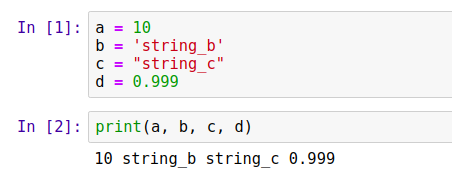
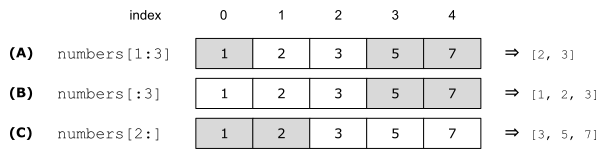

---

title: Introduction to Python
description: Get to know Python in 10 minutes!
image: article/img/cover/python.jpg
layout: article

---

# Introduction to Python


In this article, we’ll cover the basics of Python:

*   Syntax: variables and control-flow structures
*   Collections: lists, tuples, sets, and dictionaries
*   List comprehensions: a concise way of operating on collections
*   Reusability: functions, classes and importing code
*   Package management: using pip for installing libraries
*   Running python scripts 


To go through this tutorial, you need to have Python and Jupyter Notebook.
The easiest way to get them is to use [Anaconda](https://www.anaconda.com/).

&nbsp;

## Variables

Python is a dynamic language — so you don’t need to declare types like in Java or C++. For example, to create a variable with integer or string, we only need to do a simple assignment:


```python
a = 10 # a is an integer
b = 'string_b' 
c = "string_c" # b and c are strings
d = 0.999 # d is a float
```

To print something to standard output, we can use the `print` function:


```python
print(a, b, c, d)
```

It prints:

```
10 string_b string_c 0.999
```


To execute the code, you can put each code snippet in a separate jupyter notebook cell and then execute it. For executing the code in the cell, you can press the “Run” button, or use “Shift+Enter” hotkey 





When we pass multiple arguments to `print`, like in the example above, it adds a space between the arguments when printing.

We can put multiple variables together with a special construction called _tuple_:


```python
t = (a, b)
```


When we print `t`, we get the following:


```
(10, 'string_b')
```


To unwrap a tuple into multiple variables we use _tuple assignment_:


```python
(c, d) = t
```


Now `c` and `d` contain the first value of the tuple and the second one, respectively:


```python
print(c, d)
```


It prints:


```
10 string_b
```


We can drop the parentheses when using the tuple assignment:


```python
c, d = t
```


This produces the same result.

Tuple assignment is quite useful and can make the code shorter. For example, we can use it to swap the content of two variables:


```python
a = 10
b = 20
a, b = b, a # replace a with b and b with a
print("a =", a)
print("b =", b)
```


It will print 


```
a = 20
b = 10
```


When printing, we can have nicely formatted strings using the “`%`” operator:


```python
print("a = %s" % a) # replace "%s" with the content of a
print("b = %s" % b) # replace "%s" with the content of b
```


It will produce the same output:


```
a = 20
b = 10
```


Here `%s` is a placeholder: in this case, it means that we want to format the passed argument as a string. Other commonly used options are:


* “`%d`” to format it as a number,
*  “`%f`” to format it as a floating-point number.

We can pass in multiple arguments to the format operator in a tuple:


```python
print("a = %s, b = %s" % (a, b))
```


The first occurrence of the placeholder `%s` will be replaced by `a`, and the second - by `b`, so it will produce the following:


```
a = 20, b = 10
```


Finally, if we have a floating-point number, we can use special formatting for it:


```python
n = 0.0099999999
print("n = %.2f" % n)
```


This will round the float to the second decimal point when formatting the string, so we will see “0.01” when executing the code.

There are many options for formatting strings, and also other ways of formatting. For example, there’s also the so-called “new” way of formatting using the `string.format` method, which we won’t cover here. You can read more about these formatting options at [https://pyformat.info](https://pyformat.info/) or in the official documentation.

&nbsp;

## Control-flow

There are three control-flow statements in Python: “if”, “for” and “while”. Let’s take a look at each of them.

&nbsp;

### Conditions

A simple way to control the execution flow of a program is the “if” statement. In Python the syntax for “if” is the following:


```python
a = 10

if a >= 5:
    print('the statement is true')
else:
    print('the statement is false')
```


This will print the first statement:


```
the statement is true
```


Note that in Python we use indentation for grouping the code after the “if” statement. We can chain multiple “if” statements together using “elif”, which is a shortening for “else-if”:


```python
a = 3

if a >= 5:
    print('the first statement is true')
elif a >= 0:
    print('the second statement is true')
else:
    print('both statements are false')
```


This code will print the second statement:


```
the second statement is true
```

&nbsp;

### For loop

When we want to repeat the same piece of code multiple times, we use loops. The traditional “for” loop in Python looks like that:


```python
for i in range(10):
    print(i)
```


This code will print numbers from 0 to 9, and 10 is not included:


```
0
1
2
3
4
5
6
7
8
9
```


When specifying the range we can set the starting number, the end number, and the increment step:


```python
for i in range(10, 100, 5):
    print(i)
```


This code will print numbers from 10 to 100 (excluded) with step 5: 10, 15, 20, …, 95.

To exit the loop earlier, we can use the `break` statement:


```python
for i in range(10):
    print(i)
    if i > 5:
        break
```


This code will print numbers between 0 and 6. When `i` is 6, it will break the loop, so it will not print any numbers after 6:


```
0
1
2
3
4
5
6
```


To skip an iteration of the loop, we use the `continue` statement:


```python
for i in range(10):
    if i <= 5:
        continue
    print(i)
```


This code will skip the iterations when `i` is 5 or less, so it will print only numbers starting from 6:


```python
6
7
8
9
```

&nbsp;

### While loop

The “while” loop is also available in Python. It executes while a certain condition is `True`. For example:


```python
cnt = 0 

while cnt <= 5:
    print(cnt)
    cnt = cnt + 1
```


In this code, we repeat the loop while the condition `cnt &lt;= 5` is `True`. Once this condition is no longer `True`, the execution stops. This code will print numbers between 0 and 5, including 5:


```
0
1
2
3
4
5
```


We can use the `break` and `continue` statements in while loops as well.

&nbsp;

## Collections

Collections are special containers that allow keeping multiple elements in them. We will look at four types of collections: lists, tuples, sets, and dictionaries.

&nbsp;

### Lists

A _list_ is an ordered collection with the possibility to access an element by index. To create a list, we can simply put elements inside squared brackets:


```python
numbers = [1, 2, 3, 5, 7, 11, 13]
```


To get an element by its index, we can use the brackets notation:


```python
el = numbers[1]
print(el)
```


Indexing starts at 0 in Python, so when we ask for the element at index 1, we get “2”. 

We can also change the values in the list:


```python
numbers[1] = -2
```


To access the elements from the end, we can use negative indices. For example, “-1” will get the last element, “-2” - the one before the last and so on:


```python
print(numbers[-1], numbers[-2])
```


As we expect, it prints “13 11”.

To add elements to the list, use the `append` function. It will append the element to the end of the list:


```python
numbers.append(17)
```


To iterate over the elements of a list, we use a “for” loop:


```python
for n in numbers:
    print(n)
```


When we execute it, we see all the elements printed:


```
1
-2
3
5
7
11
13
17
```


This is also known as a “for-each” loop in other languages: we execute the body of the loop for each element of the collection. It doesn’t include the indices, only the elements themselves. If we also need to have access to the index of each element, we can use `range`, as we did previously:


```python
for i in range(len(numbers)):
    n = numbers[i]
    print("numbers[%d] = %d" % (i, n))
```


The function `len` returns the length of the list, so this code is roughly equivalent to the traditional way of traversing an array in C or Java and accessing each element by its index. When we execute it, the code prints the following:


```python
numbers[0] = 1
numbers[1] = -2
numbers[2] = 3
numbers[3] = 5
numbers[4] = 7
numbers[5] = 11
numbers[6] = 13
numbers[7] = 17
```


A more “pythonic” (more common and idiomatic in the Python world) way of achieving the same thing is using the `enumerate` function:


```python
for i, n in enumerate(numbers):
    print("numbers[%d] = %d" % (i, n))
```


In this code, the `i` variable will get the index, and the `n` variable - the respective element from the list. This code will produce the exact same output as the previous loop.

To concatenate multiple lists into one, we can use the plus operator. For example, consider two lists:


```python
list1 = [1, 2, 3, 5]
list2 = [7, 11, 13, 17]
```


We can create a third list that contains all the elements from `list1` followed by the elements from `list2` by concatenating the two lists: 


```python
new_list = list1 + list2
```


This will produce the following list:


```
[1, 2, 3, 5, 7, 11, 13, 17]
```


Finally, it’s also possible to create a list of lists: a list whose elements are lists as well. To show that, let’s first create three lists with numbers:


```python
list1 = [1, 2, 3, 5]
list2 = [7, 11, 13, 17]
list3 = [19, 23, 27, 29]
```


Now let’s put them together in another list:


```python
lists = [list1, list2, list3]
```


Now `lists` is a list of lists. When we iterate over it with a for loop, at each iteration we get a list:


```python
for l in lists:
    print(l)
```


This will produce the following output:


```
[1, 2, 3, 5]
[7, 11, 13, 17]
[19, 23, 27, 29]
```

&nbsp;

### Slicing

Another useful concept in Python is _slicing_ &ndash; it’s used for getting a part of the list. For example, let’s consider the list of numbers again:


```python
numbers = [1, 2, 3, 5, 7]
```


If we want to select a sublist with the first three elements, we can use the colon operator (“:”) for specifying the range for selection:


```python
top3 = numbers[0:3]
```


In this case, “0:3” means “select elements starting from index 0 till index 3 (exclusive)”. The result contains the first three elements: `[1, 2, 3]`. Note that it selects elements at the indices 0, 1 and 2, so 3 is not included.

If we want to include the beginning of the list, we don’t need to specify the first number in the range:


```python
top3 = numbers[:3]
```


If we don’t specify the second number in the range, we get everything till the end of the list:


```python
last3 = numbers[2:]
```


The list `last3` will contain the last three elements: `[3, 5, 7]` .




&nbsp;


### Tuples

We already met tuples previously in the Variables section. Tuples are also collections, they are quite similar to lists. The only difference is that they are immutable: once you create a tuple, you cannot change the content of the tuple.

To create a tuple we use parentheses:


```python
numbers = (1, 2, 3, 5, 7, 11, 13)
```


Like with lists, we can get the value by index:


```python
el = numbers[1]
print(el)
```


However, we cannot update the values in the tuple. When we try to do it, we get an error:


```python
numbers[1] = -2
```


If we try to execute this code, we get


```
---------------------------------------------------------------------------
TypeError                                 Traceback (most recent call last)
<ipython-input-15-9166360b9018> in <module>
----> 1 numbers[1] = -2

TypeError: 'tuple' object does not support item assignment
```


Likewise, we cannot append a new element to the tuple. However, we can use concatenation to achieve the same result:


```python
numbers = numbers + (17,)
```


Here we create a new tuple that contains the old numbers and we concatenate it with another tuple that contains only one number: 17. Note that we need to add a comma to make a tuple, otherwise Python will treat it as a simple number.

Effectively, the expression above is the same as writing 


```python
numbers = (1, 2, 3, 5, 7, 11, 13) + (17,)
```


After doing it, we get a new tuple that contains a new element, so when printing it, we get


```
(1, 2, 3, 5, 7, 11, 13, 17)
```

&nbsp;

### Set

Another useful collection is _set_: it’s an unordered collection that keeps only unique elements. Unlike lists, it cannot contain duplicates and it’s also not possible to access an individual element of a set by index. 

To create a set, we use curly braces:


```python
numbers = {1, 2, 3, 5, 7, 11, 13}
```

Note: To create an empty set, we need to use `set`:

```python
empty_set = set()
```

Simply putting empty curly braces will create a dictionary - a collection that we cover later in this appendix:

```python
empty_dict = {}
```


Sets are faster than lists for checking if the collection contains an element. We use the “in” operator for checking it:


```python
print(1 in numbers)
```


Since “1” is in the `numbers` set, this line of code will print `True`. 

To add an element to the set, we use the `add` method:


```python
numbers.add(17)
```


To iterate over all the elements of the set we again use a for loop: 


```python
for n in numbers:
    print(n)
```


When we execute it, it prints


```
1
2
3
5
7
11
13
17
```

&nbsp;


### Dictionaries

Dictionary is another extremely useful collection in Python: we use it to build a key-value map. To create a dictionary, we use curly braces, and to separate the keys and values we use colons (“:”): 


```python
words_to_numbers = {
    'one': 1,
    'two': 2,
    'three': 3,
}
```


To retrieve the value by the key, we use brackets:


```python
print(words_to_numbers['one'])
```


If something is not in the dictionary, Python raises an exception:


```python
print(words_to_numbers['five'])
```


When we try to execute it, we get the following error:


```
---------------------------------------------------------------------------
KeyError                                  Traceback (most recent call last)
<ipython-input-38-66a309b8feb5> in <module>
----> 1 print(words_to_numbers['five'])

KeyError: 'five'
```


To avoid it, we can first check if the key is in the dictionary before attempting to get the value. We can use the “in” statement for checking it:


```python
if 'five' in words_to_numbers:
    print(words_to_numbers['five'])
else:
    print('not in the dictionary')
```


When running this code, we’ll see “not in the dictionary” in the output.

Another option is to use the `get` method. It doesn’t raise an exception, but returns `None` if the key is not present in the dictionary:


```python
value = words_to_numbers.get('five')
print(value)
```


It will print “None”. When using `get`, we can specify the default value in case the key is not present in the dictionary:


```python
value = words_to_numbers.get('five', -1)
print(value)
```


In this situation, we’ll get “-1”.

To iterate over all the keys of a dictionary, we use a for loop over the results from the `keys` method:


```python
for k in words_to_numbers.keys():
    v = words_to_numbers[k]
    print("%s: %d" % (k, v))
```


It will print:


```python
one: 1
two: 2
three: 3
```


Alternatively, we can directly iterate over the key-value pairs in the dictionary using the `items` method:


```python
for k, v in words_to_numbers.items():
    print("%s: %d" % (k, v))
```


It produces exactly the same output as the previous code.

&nbsp;

### List comprehension

_List comprehension_ is a special syntax for creating and filtering lists in Python. Let’s again consider a list with numbers:


```python
numbers = [1, 2, 3, 5, 7]
```


Suppose we want to create another list where all the elements of the original list are squared. For that we can use a for loop:


```python
squared = []

for n in numbers:
    s = n * n
    squared.append(s)
```


We can concisely rewrite this code into one single line using list comprehension:


```python
squared = [n * n for n in numbers]
```


It’s also possible to add an if condition inside to process only the elements that meet the condition:


```python
squared = [n * n for n in numbers if n > 3]
```


It translates to the following code:


```python
squared = []

for n in numbers:
    if n > 3:
        s = n * n
        squared.append(s)
```


If all we need is to apply the filter and leave the elements as is, we can do that as well:


```python
filtered = [n for n in numbers if n > 3]
```


This translates to 


```python
filtered = []

for n in numbers:
    if n > 3:
        filtered.append(n)
```


It’s also possible to use list comprehension for creating other collections with a slightly different syntax. For example, for dictionaries we put curly braces around the expression and use a colon to separate keys with values: 


```python
result = {k: v * 10 for (k, v) in words_to_numbers.items() if v % 2 == 0}
```


This is a shortcut for the following code:


```python
result = {}

for (k, v) in words_to_numbers.items():
    if v % 2 == 0:
        result[k] = v * 10
```

**Warning**: When learning about list comprehension it might be tempting to start using it everywhere. Typically it fits best for simple cases, but for more complex situations, for loops should be preferred over list comprehension for better code readability. If in doubt, use for loops.

&nbsp;

## Code reusability

At some point, when we write a lot of code, we need to think about how to organize it better. We can achieve that by putting small reusable pieces of code inside functions or classes. Let’s take a look at how to do it.

&nbsp;

### Functions

To create a function we use the `def` keyword:


```python
def function_name(arg1, arg2):
    # body of the function
    return 0
```


When we want to exit the function and return some value, we use the `return` statement. If we simply put `return` without any value or don’t include `return` in the body of the function, the function will return `None`.

For example, we can write a function that prints values from 0 up to a specified number:


```python
def print_numbers(max): #A
    for i in range(max + 1): #B
        print(i)

#A create a function with one argument: "max"
#B use the "max" argument inside the function
```


To call this function, simply add the arguments in parentheses after the name:


```python
print_numbers(10)
```


It’s also possible to provide the names of the arguments when invoking the function:


```python
print_numbers(max=10)
```

&nbsp;

### Classes

Classes provide higher-level abstraction than functions: they can have an internal state and methods that operate on this state. Let’s consider a class `NumberPrinter` that does the same thing as the function from the previous section: it prints numbers. 


```python
class NumberPrinter:

    def __init__(self, max): #A
        self.max = max #B

    def print_numbers(self): #C
        for i in range(self.max + 1): #D
            print(i)

#A the class initializer
#B assign the max argument to the "max" field 
#C method of the class
#D use the internal state when invoking the method
```


In this code, `__init__` is the initializer: it runs whenever we want to create an instance of a class:


```python
num_printer = NumberPrinter(max=10)
```


Note that inside the class the `__init__` method has two arguments: `self` and `max`. The first argument of all the methods always has to be `self`: this way we can use `self` inside the method to access the state of the object. 

However, when we invoke the method later, we don’t pass anything the `self` argument: it’s hidden from us. So, when we invoke the `print_number` method on the instance of the `NumberPrinter` object, we simply put empty parentheses with no parameters:


```python
num_printer.print_numbers()
```


This code produces the same output as the function from the previous section. 

&nbsp;

### Importing code

Now suppose we want to put some code to a separate file. Let’s create a file called `useful_code.py` and place it in the same folder as the notebook.

Inside the file, we can put the function and the class we just created: this way, we create a module with the name “useful_code”. To access the function and the class inside the module, we import them using the `import` statement:


```python
import useful_code
```


Once it’s imported, we can use it:


```python
num_printer = useful_code.NumberPrinter(max=10)
num_printer.print_numbers()
```


It’s also possible to import a module and give it a short name: e.g. if instead of writing “`useful_code`” we want to write “`uc`”, we can do


```python
import useful_code as uc

num_printer = uc.NumberPrinter(max=10)
num_printer.print_numbers()
```


This is a very common idiom in scientific Python: packages like NumPy and Pandas are typically imported with shorter aliases:


```python
import numpy as np
import pandas as pd
```


Finally, if we don’t want to import everything from the module, we can choose what exactly to import using “`from ... import`” syntax:


```python
from useful_code import NumberPrinter

num_printer = NumberPrinter(max=10)
num_printer.print_numbers()
```

&nbsp;

## Installing libraries

It’s possible to put our code into packages that are available for everyone. For example, NumPy or Pandas are such packages. They are already available in the Anaconda distribution, but typically they don’t come pre-installed with Python. 

To install such external packages, we can use the built-in package installer called “pip”. We use the command line and specify the packages we want to install:


```bash
pip install numpy scipy pandas
```


It’s also possible to specify the version of each package when installing:


```bash
pip install numpy==1.16.5 scipy==1.3.1 pandas==0.25.1
```


When we already have a package, but it’s outdated and we want to update it, we need to run `pip install` with the `-U` flag:


```bash
pip install -U numpy
```


Finally, if we want to remove a package, we use `pip uninstall`


```bash
pip uninstall numpy
```

&nbsp;

## Python programs

To execute Python code, we can simply call the Python interpreter and specify the file we want to execute. For example, to run the code inside our “useful_code.py” script, execute the following command in the command line:  


```bash
python useful_code.py
```


When we execute it, nothing happens: we only declare a function and a class there and don’t actually use them. To see some results, we need to add a few lines of code to the file. For example, we can add the following:


```python
num_printer = NumberPrinter(max=10)
num_printer.print_numbers()
```


Now when we execute this file, we see the numbers that `NumberPrinter` prints. 

However, when we import a module, internally Python executes everything inside the module. It means that the next time we do “`import useful_code`” in the notebook, we’ll see the numbers printed there.

To avoid it, we can tell the Python interpreter that some code needs to run only when executed as a script - and not imported. To achieve that, we put our code inside the following construction:


```python
if __name__ == "__main__":
    num_printer = NumberPrinter(max=10)
    num_printer.print_numbers()
```


Finally, we can also pass arguments when running python scripts 


```python
import sys

# declarations of print_numbers and NumberPrinter

if __name__ == "__main__":
    max_number = int(sys.argv[1]) #A
    num_printer = NumberPrinter(max=max_number) #B
    num_printer.print_numbers()

#A parse the parameter as an integer: by default, it's a string
#B pass the parsed argument to the NumberPrinter instance
```


Now we can run the script with custom parameters:


```bash
python useful_code.py 5
```


As a result, we’ll see numbers from 0 to 5:


```
0
1
2
3
4
5
```

&nbsp;

## Summary

*   Python is a dynamically typed language, so we don’t need to specify types when declaring variables.
*   Conditions (if statements) and loops (for and while loops) are used to control the execution flow of Python programs.
*   Lists and tuples are ordered collections: we can access the elements by index. However, tuples, unlike lists, are immutable: we cannot modify the elements inside the tuple.
*   Set is an unordered collection that doesn’t contain duplicate elements. We use sets when we need to quickly check if an element is contained in a collection.
*   We use dictionaries when we need to map keys to values. 
*   List comprehension lets us concisely create and filter lists and other collections.
*   To achieve code reusability, put the code in functions and classes. We can also organize the code in modules and import only the pieces we need.
*   To install a Python package, we can use pip, which is a package manager for Python.