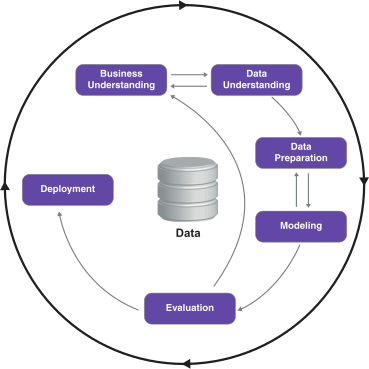

---

title: Machine Learning Bookcamp
layout: article

---

### CRISP-DM

Cross-industry standard process for data mining, known as CRISP-DM,[1] is an open standard process model that describes common approaches used by data mining experts. It is the most widely-used analytics model.[2]

In 2015, IBM released a new methodology called Analytics Solutions Unified Method for Data Mining/Predictive Analytics[3] [4] (also known as ASUM-DM) which refines and extends CRISP-DM.

### History
CRISP-DM was conceived in 1996 and became a European Union project under the ESPRIT funding initiative in 1997. The project was led by five companies: Integral Solutions Ltd (ISL), Teradata, Daimler AG, NCR Corporation and OHRA, an insurance company.

This core consortium brought different experiences to the project: ISL, later acquired and merged into SPSS. The computer giant NCR Corporation produced the Teradata data warehouse and its own data mining software. Daimler-Benz had a significant data mining team. OHRA was just starting to explore the potential use of data mining.

The first version of the methodology was presented at the 4th CRISP-DM SIG Workshop in Brussels in March 1999,[5] and published as a step-by-step data mining guide later that year.[6]

Between 2006 and 2008 a CRISP-DM 2.0 SIG was formed and there were discussions about updating the CRISP-DM process model.[7] The current status of these efforts is not known. However, the original crisp-dm.org website cited in the reviews,[8][9] and the CRISP-DM 2.0 SIG website[7] are both no longer active.

While many non-IBM data mining practitioners use CRISP-DM,[10][11][12] IBM is the primary corporation that currently uses the CRISP-DM process model. It makes some of the old CRISP-DM documents available for download[6] and it has incorporated it into its SPSS Modeler product.

Based on current research CRISP-DM is the most widely used form of data-mining model because of its various advantages which solved the existing problems in the data mining industries. Some of the drawbacks of this model is that it does not perform project management activities. The fact behind the success of CRISP-DM is that it is industry, tool, and application neutral.[13]

### Major phases

Process diagram showing the relationship between the different phases of CRISP-DM
CRISP-DM breaks the process of data mining into six major phases[14]:

* Business Understanding
* Data Understanding
* Data Preparation
* Modeling
* Evaluation
* Deployment

The sequence of the phases is not strict and moving back and forth between different phases as it is always required. The arrows in the process diagram indicate the most important and frequent dependencies between phases. The outer circle in the diagram symbolizes the cyclic nature of data mining itself. A data mining process continues after a solution has been deployed. The lessons learned during the process can trigger new, often more focused business questions, and subsequent data mining processes will benefit from the experiences of previous ones.

